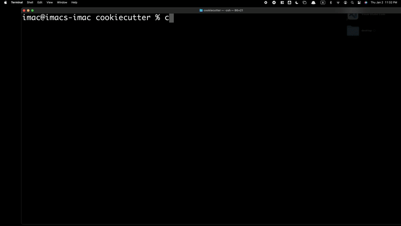

|Icon| |title|_
===============

.. |title| replace:: bg-cookiecutter
.. _title: https://Billingegroup.github.io/cookiecutter

.. |Icon| image:: https://avatars.githubusercontent.com/Billingegroup
        :target: https://Billingegroup.github.io/cookiecutter
        :height: 100px

|PyPi| |Forge| |PythonVersion| |PR|

|CI| |Codecov| |Black| |Tracking|

.. |Black| image:: https://img.shields.io/badge/code_style-black-black
        :target: https://github.com/psf/black

.. |CI| image:: https://github.com/Billingegroup/cookiecutter/actions/workflows/matrix-and-codecov-on-merge-to-main.yml/badge.svg
        :target: https://github.com/Billingegroup/cookiecutter/actions/workflows/matrix-and-codecov-on-merge-to-main.yml

.. |Codecov| image:: https://codecov.io/gh/Billingegroup/cookiecutter/branch/main/graph/badge.svg
        :target: https://codecov.io/gh/Billingegroup/cookiecutter

.. |Forge| image:: https://img.shields.io/conda/vn/conda-forge/bg-cookiecutter
        :target: https://anaconda.org/conda-forge/bg-cookiecutter

.. |PR| image:: https://img.shields.io/badge/PR-Welcome-29ab47ff

.. |PyPi| image:: https://img.shields.io/pypi/v/bg-cookiecutter
        :target: https://pypi.org/project/bg-cookiecutter/

.. |PythonVersion| image:: https://img.shields.io/pypi/pyversions/bg-cookiecutter
        :target: https://pypi.org/project/bg-cookiecutter/

.. |Tracking| image:: https://img.shields.io/badge/issue_tracking-github-blue
        :target: https://github.com/Billingegroup/cookiecutter/issues

``bg-cookiecutter`` is a Python package standard and generator for scientific code. Use ``bg-cookiecutter`` to launch a new project or migrate existing ones to support the latest Python versions and streamline the process of distributing and maintaining your software package.

- Automated `PEP8 <https://peps.python.org/pep-0008/>`_ and `PEP256 <https://peps.python.org/pep-0256/>`_ standard checks.
- Automated PyPI/GitHub release, testing, documentation, and CHANGELOG updates.
- Streamlined package release workflow with a checklist.
- Latest Python version support compatible with `SPEC0 <https://scientific-python.org/specs/spec-0000/>`_.
- Rich README template containing badges, installation, support, and contribution guide.
- Automatic spelling check, linting for .json, .yml, and .md files.

Demo
----

Getting started
---------------

Are you interested in amplifying your scientific contribution by standarlizing and distributing your Python code? Begin with the ``Getting started`` page in our online documentation at https://Billingegroup.github.io/cookiecutter!

How to cite bg-cookiecutter
---------------------------

If you use ``bg-cookiecutter`` to standardize your Python software, we would like you to cite bg-cookiecutter as follows:

   bg-cookiecutter, https://github.com/Billingegroup/cookiecutter
