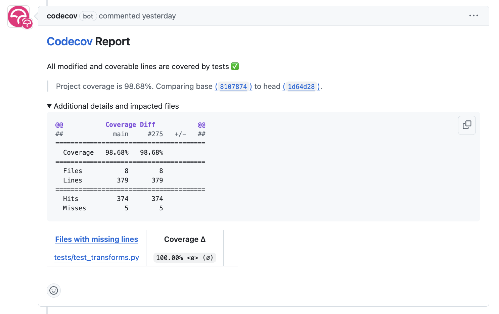
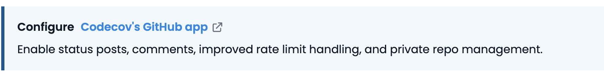
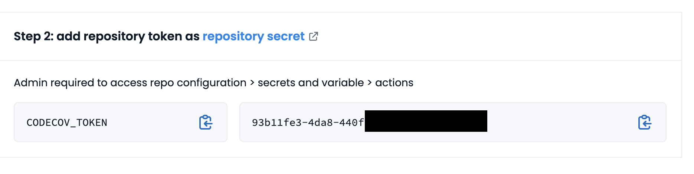
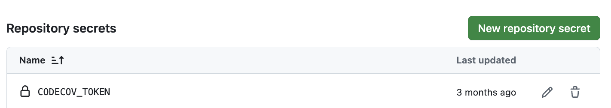
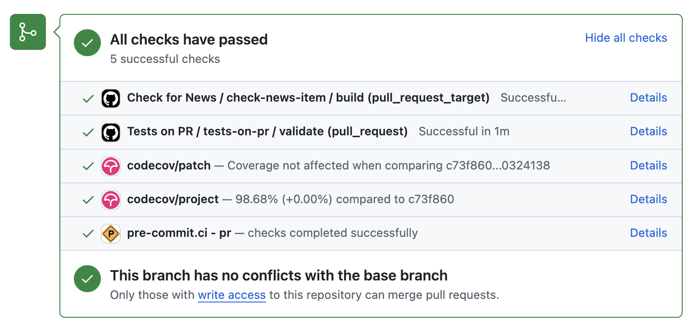

:tocdepth: -1

.. index:: cookiecutter-guide

.. _cookiecutter-title:

===============================
How to cookiecut Python package
===============================

.. _cookiecutter-installation:

Installation
------------

To get started, install ``cookiecutter``, ``black``, and ``pre-commit`` in a new conda environment. Follow the steps below:

Create a new environment named ``cookiecutter_env``: ::

        conda create -n cookiecutter_env python=3.13

Activate the environment: ::

        conda activate cookiecutter_env

Install packages: ::

        pip install cookiecutter black pre-commit

You are now ready to cookiecut your Python package!

Overview
--------

We have divided the cookiecutting process into four workflows:

1. :ref:`Pre-commit workflow: <cookiecutter-workflow-pre-commit>` you will use automatic formatting tools to standardize your package with PEP8 before migrating it to the Billinge group's project structure with ``cookiecutter``. Then, the ``pre-commit`` library installed is used ensure the code is in good shape. You can skip this step if you are starting a new project.

2. :ref:`Cookiecutting workflow: <cookiecutter-workflow-main>` After your code is formatted, you will use the ``cookiecutter`` library to generate a new project inside the package directory. The new project contains dynamically filled templates based on your inputs such as repository name, license, and contributors. Then, you will move files from the old to the new structure using Git.

3. :ref:`API documentation build workflow: <cookiecutter-workflow-api>` Once you have cookiecuttered the package, you will use our Python script to automatically generate API documentation for your package and render the documentation locally.

4. :ref:`Final sign-off: <cookiecutter-workflow-final>` After you've checked the licenses, README, and documentation, you will host your package documentation online. Once you are done with this page, we will guide you on how to release your package on a separate page :ref:`here <release-guide>`.

Tips and how to receive support
-------------------------------

We offer the following ways to help guide you through the cookiecutting process:

1. You may cross-check with the Billinge group's up-to-date cookiecuttered package, ``diffpy.utils``: https://github.com/diffpy/diffpy.utils.

2. If you have any questions, first read the :ref:`FAQ <frequently-asked-questions>` for how to customize your package and certain design decisions in the cookiecutter template.

3. After you've cross-checked and searched through the FAQ, please feel free to ask questions by creating an issue on the Cookiecutter repository `here <https://github.com/Billingegroup/cookiecutter/issues>`_.

.. _cookiecutter-workflow-pre-commit:

1. Pre-commit workflow
----------------------

.. Important:: Skip this section and go to :ref:`2. Cookiecutter main workflow <cookiecutter-workflow-main>` if you are starting a new project!

#. Fork and clone the repository.

#. ``cd`` into the top-level directory of that project.

#. Type ``git pull upstream main`` to sync with the main branch.

#. Double-check that no bug-fix etc. pull-requests are waiting to be merged. If you are a member, check with the project repository owner if you are unsure.

#. Create a new branch called ``black``.

#. Create ``pyproject.toml``. Copy and paste the following to ``pyproject.toml``.

    .. code-block:: bash

        [tool.black]
        line-length = 115
        include = '\.pyi?$'
        exclude = '''
        /(
            \.git
        | \.hg
        | \.mypy_cache
        | \.tox
        | \.venv
        | \.rst
        | \.txt
        | _build
        | buck-out
        | build
        | dist

        # The following are specific to Black, you probably don't want those.
        | blib2to3
        | tests/data
        )/

#. Run ``black src`` in your Terminal. If your source code is in a different directory, replace ``src`` with the appropriate directory path. This will automatically format your code to PEP8 standards given the line-length provided under ``line-length`` above in ``pyproject.toml``.

#. Add and commit the automatic changes by ``black``. The commit message can be ``git commit -m "style: apply black to src directory with black configured in pyproject.toml"``.

#. Run ``black .`` Here, you are running black across the entire package directory. Then, test your package with unit tests locally.

#. git add and commit the changes. The commit message can be ``git commit -m "style: apply black to all files in the project directory"``.

#. Create a pull request into ``main``. The pull request title can be ``cookiecut: Apply black to project directory with no manual edits``.

#. After the ``black`` branch has been merged to ``main``, type ``git checkout main && git pull upstream main`` and create a new branch called ``precommit`` by typing ``git checkout -b precommit``.

#. Copy and paste two files of ``.flake8`` `here <https://github.com/Billingegroup/cookiecutter/blob/main/%7B%7B%20cookiecutter.repo_name%20%7D%7D/.flake8>`_ and ``.pre-commit-config.yaml`` `here <https://github.com/Billingegroup/cookiecutter/blob/main/%7B%7B%20cookiecutter.repo_name%20%7D%7D/.pre-commit-config.yaml>`_ to your project directory. Cross-check with https://github.com/diffpy/diffpy.utils.

#. Run ``pre-commit run --all-files`` in your Terminal. This will attempt to lint your code such as docstrings, extra spaces, across all file types such as ``.yml``, ``.md``, ``.rst``, etc. However, most likely, you will have to manually fix some of the errors raised by ``flake8``.

#. Before manually editing, let's first take a look at the changes made by running ``git status`` to get an overview of the files modified and then by running ``git diff <file-or-directory-path>`` to see the specific changes. If you do not want the new changes, you can run ``git restore <file-or-directory-path>`` to revert the changes.

    .. note::

        Q1. Do you want to prevent certain automatic modifications on files? You can add the folder or extension to the ``exclude`` section in ``.pre-commit-config.yaml`` with an example shown `here <https://github.com/Billingegroup/cookiecutter/blob/main/.pre-commit-config.yaml>`_.

        Q2. Do you want to ignore certain spelling recommendations by Codespell? Please refer to this section in the FAQ :ref:`here <codespell-add-word>`.

#. At this point, you may have flake8 errors but we want to address them in a separate pull request. Hence, git add and commit and push the automatic changes made by ``precommit`` and create a pull request to ``main``. The commit message can be ``style: apply pre-commit without manual modification`` and the pull request title can be ``cookiecut: Apply pre-commit to project directory with no manual edits``.

#. After the ``precommit`` branch has been merged to ``main``, run ``git checkout main && git pull upstream main`` and create a new branch called ``flake8`` by typing ``git checkout -b flake8``. If you have many flake8 errors and types, feel free to create one branch for each specific type of error, like ``flake8-length``.

Here are some tips to reduce cognitive overload:

    1. Start with easier error types to fix, such as line lengths and "module imported but not used", etc.

    2. Create multiple PRs, each containing a specific theme (e.g., "Fix docstring line-length flake8 errors" using the ``flake8-length`` branch, etc.) to reduce cognitive overload for the reviewer.

    3. If you are unsure, suppress the flake8 error by adding ``# noqa: <error-code>`` at the end of the line. For example, ``import numpy as np # noqa: E000`` but make sure you create an issue for this so that you can revisit them after cookiecutting.

For each `flake8` branch, create a PR request to ``main``. Since you are fixing flake8 errors, the commit message can be ``style: fix flake8 <readable-error-type> errors`` and the pull request title can be ``cookiecut: Fix flake8 <readable-error-type> errors``. In each PR, feel free to communicate the remaining flake8 issues in each pull request to track progress.

Congratulations! You have successfully completed the pre-commit workflow. You may proceed to the section to now transform your package structure!

.. _cookiecutter-workflow-main:

1. Cookiecutter main workflow
-----------------------------

If you are migrating an existing project,

.. Attention:: Ensure no files are overwritten or lost.

    - Do NOT delete/remove any files before confirming that it is absolutely unnecessary. Create an issue or contact the maintainer.

    - Do NOT delete project-specific content such as project descriptions in README, license information, authors, tutorials, examples.

    If you are unsure, please ask for help.

If you are here starting a new project, the :ref:`1, Pre-commit workflow <cookiecutter-workflow-pre-commit>` section is completed in the project template. Visit `installation <_cookiecutter-installation>`_ section and download the dependencies that we will be using.

1. Type ``cookiecutter https://github.com/billingegroup/cookiecutter`` inside the package directory.

2. Answer the questions as the following -- note that (default) means to hit enter without modifying anything:

:github_org: The GitHub organization name or owner's GitHub username. e.g., ``Billingegroup``.

:keywords: The keywords of the project. Each word is separated by a comma and a space. e.g., ``pdf, diffraction, neutron, x-ray``. The keywords may be found in ``pyproject.toml`` or ``setup.py``.

:project_name: The name of the project e.g., ``my-package``. For a namespace package, use e.g., ``diffpy.my-package``.

:package_dist_name: The name in the package distribution in PyPI and conda-forge .If your package name contains ``_``, replace it with ``-``. e.g., ``my-package``. For a namespace package, use e.g., ``diffpy.my-package``.

:package_dir_name: The name of the package directory. It must be lowercase e.g., ``my_package`` so that it can be imported as ``import my_package`` in a Python script.

:repo_name: The repository name of the project displayed on GitHub. It should be identical as the project_name.

:min_python: The minimum Python version. The default is ``3.11``.

:max_python: The maximum Python version. The default is ``3.13``.

:have_c_code: Whether the package require C/C++ code that requires building the package. For pure Python packages, this is ``False``. The default is ``False``.

:headless_GUI_test: Run headless testing in GitHub CI. If your package does not contain GUI, the default is ``False``.

:workflow_version: Version of the reuseuable workflow to use. ``v0`` is the default.

.. Important:: Skip the rest of Cookiecutter main workflow if you are starting a new project! Proceed to the :ref:`3. API documentation workflow<cookiecutter-workflow-api>` below. Otherwise, please continue!

3. cd into the new ``diffpy.<package_name>/`` directory (e.g., in our example ``pwd`` would return ``~/dev/diffpy.pdfmorph/diffpy.pdfmorph``) (we will refer to the nested directory as the "**cookiecutter**" directory and ``~/dev/diffpy.pdfmorph/`` as the "**main**" directory).

4. Type ``ls -als`` (if you have the alias, this is ``ll``) compare the directory structures in this directory tree to that in the original repo to see what is different (ignore files at this point). Nothing to do here, just get familiar with the differences.

5. Type ``mv ../.git .`` to move the ``.git`` directory from the main repo to the cookiecutter repo.

6. Create a new branch for all the changes, e.g., ``git checkout -b cookierelease``.

7. Type ``cp -n -r ../src .`` to copy the source code from the main to the cookiecutter repo, without overwriting existing files in the destination. If there is no src directory, it will be something like ``cp -n -r ../diffpy ./src``.

8. Type ``git status`` to see a list of files that have been (1) untracked, (2) deleted, (3) modified. Untracked files are in the cookiecutter but not in the original repo, deleted files are in the original but haven't been moved over, and modified files are in both but have been changed.

9.  Let's now copy over any documentation, similar to what we did with the src files. We want to copy over everything in the ``doc/<path>/source`` file from the old repo to the ``doc/source`` file in the new repo.

    1. If you see this extra ``manual`` directory, run ``cp -n -r ../doc/manual/source/* ./doc/source``.

    2. If files are moved to a different path, open the project in PyCharm and do a global search (ctrl + shift + f) for ``../`` or ``..`` and modify all relative path instances.

10. Now we will work on correcting all the things that are wrong.

    1. Add and commit each of the (1) untracked files to the git repo. These files are in the cookiecutter repo but not in the main repo, so can simply be "git added". Do it one (or a few) at a time to make it easier to rewind by having multiple commits.

    2. Make a PR of your ``cookierelease`` branch by pushing your fork and opening a PR.

    3. Files showing as (2) "deleted" upon git status are in the main repo but not in the cookiecutter repo. We took care of most of these by moving over the src tree, but let's do the rest now. Go down the list and for <filename> in the ``git status`` "delete" files type ``cp -n ../<filepath>/<filename> ./<target_filepath>``. Do not move files that we do not want. If you are unsure, feel free to confirm with Simon.

    4. Files that have been (3) modified exist in both places and need to be merged **manually**. Do these one at a time. First open the file in PyCharm, then select ``Git|current file|show diff`` and the differences will show up. Select anything you want to inherit from the file in the main repo. For example, you want to copy useful information such as LICENSE and README files from the main repo to the cookiecutter repo.

    5. Any files that we moved over from the old place, but put into a new location in the new repo, we need to delete them from git. For example, files that were in ``doc/manual/source/`` in the old repo but are not ``doc/source`` we correct by typing ``git add doc/manual/source``.

11. Run pytest ``python -m pytest`` or ``pytest`` to make sure everything is working. There should be no errors if all tests passed previously when you were working on pre-commit. You may encounter deprecation warnings. There might be several possibilities:

 fixes separate from cookiecuttering. Remember to add it to Github issue.

    2. Most ``pkg_resources`` deprecation warnings will be fixed by cookiecutter, but if you are in a diffpy package using unittests and see this warning you can fix them by replacing ``from pkg_resources import resource_filename`` with ``from importlib import resources`` and change ``path = resource_filename(__name__, p)`` to ``path = str(resources.files(__name__).joinpath(p))``. If you see ``collected 0 items no tests ran`` you might want to rename testing files as ``test_*.py``. Refer to the [migration guide](https://importlib-resources.readthedocs.io/en/latest/migration.html).

.. _cookiecutter-workflow-api:

3. API documentation workflow
-----------------------------

This should be done only when the above steps are finished.

When you see files with ``..automodule::`` within them, these are API documentation. However, these are not populated. We will populate them using our release scripts.

1. Make sure you have our release scripts repository. Go to ``dev`` and run ``git clone https://github.com/Billingegroup/release-scripts.git``.

2. Enter your cookiecutter package directory. For example, I would run ``cd ./diffpy.pdfmorph/diffpy.pdfmorph``.

3. Build the package using ``python -m build``. You may have to install ``python-build`` first.

4. Get the path of the package directory proper. In the case of ``diffpy.pdfmorph``, this is ``./src/diffpy/pdfmorph``. In general, for ``a.b.c``, this is ``./src/a/b/c``.

5. Run the API script. This is done by running ``python <path_to_auto_api> <package_name> <path_to_package_proper> <path_to_api_directory>``.

   1. If you have followed the steps above, the command is ``python ../../release-scripts/auto_api.py <package_name> <path_to_package_proper> ./doc/source/api``.

Make sure you build the documentation by going to ``/doc`` and running ``make html``.
The error "No module named" (``e.g. WARNING: autodoc: failed to import module 'tools' from module 'diffpy.pdfmorph'; the following exception was raised: No module named 'diffpy.utils'``) can be resolved by adding ``autodoc_mock_imports = [<pkg>]`` to your ``conf.py`` right under imports. This file is located in ``/doc/source/conf.py``.
In the case of ``PDFmorph``, this was done by adding ``autodoc_mock_imports = ["diffpy.utils",]``.

Congratulations! You may now commit the changes made by ``auto_api.py`` (and yourself) and push this commit to the cloud!
Make a PR! It will be merged, trust!

.. _cookiecutter-workflow-final:

4. Final sign-off
-----------------

#. For the ``cookierelease`` activity make a ``<branchname>.rst`` file by copying ``TEMPLATE.rst`` in the news folder and under "fixed" put ``Repo structure modified to the new diffpy standard``

#. If a new Python version has been added under "added" add `Python 3.xx, 3,xx support`. If a previous version has been removed, under "fixed", add a new item `Python 3.xx, 3.xx, support`.

#. Check the `README` and make sure that all parts have been filled in and all links resolve correctly.

#. Run through the documentation online and do the same, fix grammar and make sure all links work.

#. Follow the instructions on setting up GitHub pages here.

.. _test-package-locally:

Appendix 1. How to test your package locally
--------------------------------------------

Ensure your package has been cookiecuttered. We will use the ``diffpy.utils`` package as an example. In the package directory, follow these instructions:

.. code-block:: bash

    # Create a new environment, specify the Python version and install packages
    conda create -n diffpy_utils_env python=3.13 \
        --file requirements/test.txt \
        --file requirements/conda.txt \
        --file requirements/build.txt

    # Activate the environment
    conda activate diffpy_utils_env

    # Install your package locally
    # `--no-deps` to NOT install packages again from `requirements.pip.txt`
    pip install -e . --no-deps

    # Run pytest locally
    pytest

    # ... run example tutorials

.. _build-documentation-locally:

Appendix 2. How to build documentation locally
----------------------------------------------

Follow these steps sequentially:

.. code-block:: bash

    cd doc
    make html
    open build/html/index.html

To run as a single command:

.. code-block:: bash

    cd doc && make html && open build/html/index.html && cd ..

.. _build-documentation-preview-real-time:

Real-time preview with Visual Studio Code
^^^^^^^^^^^^^^^^^^^^^^^^^^^^^^^^^^^^^^^^^

Alternatively, you may render the Sphinx documentation by installing the `Esbonio <https://marketplace.visualstudio.com/items?itemName=swyddfa.esbonio>`_ extension in VS Code. This will allow you to see the changes in real-time and increase productivity.

.. _news-file-guide:

Appendix 3. How to write ``<branch-name>.rst`` news file
-----------------------------------------------------------------

We require that each PR includes a news item of ``<branch-name>.rst`` file under the ``news`` directory.

Motivation and audience
^^^^^^^^^^^^^^^^^^^^^^^

``.rst`` files under the ``news`` directory are used to compile and update the ``CHANGELOG.rst`` file during releases. Hence, these news items are of interest to both developers and technical users looking for specific keywords.

Guidelines for writing news items
^^^^^^^^^^^^^^^^^^^^^^^^^^^^^^^^^

- Do not remove ``news/TEMPLATE.rst``. Make a copy called ``<branch-name>.rst``.
- Do not modify other section headers in the rst file. Replace ``* <news item>`` only. See example news files in `Example 1 <https://github.com/bobleesj/diffpy.utils/blob/ba4b985df971440325442a50ac6de63eaad05fa5/news/no-empty-object.rst>`_ and `Example 2 <https://github.com/bobleesj/diffpy.utils/blob/f79e88eadfcd7b58e84c6caa591a960d79689ba9/news/prettier-pre-commit.rst>`_.
- Begin with "No news", "no news", or "no news added" for trivial changes with the following format:

.. code-block:: text

    **Added:**

    * No news: <brief reason>

Where to place the news item in ``<branch-name>.rst``?
^^^^^^^^^^^^^^^^^^^^^^^^^^^^^^^^^^^^^^^^^^^^^^^^^^^^^^

- ``**Added:**`` includes features or functionality of interest to users and developers, such as support for a new Python version or the addition of a useful feature.
- ``**Changed:**`` includes modifications that affect end-users or developers, such as API changes or dependencies replaced.
- ``**Fixed:**`` includes bug fixes or refactoring.
- ``**Deprecated:**`` includes methods, classes, or workflows that are no longer supported in the future release.
- ``**Removed:**`` includes the opposite of the "Added" section, referring to features or functionality that have been removed.

.. _codecov-token-setup:

Appendix 4. Codecov token setup for the repository
--------------------------------------------------

For each PR, we use ``Codecov`` to report the test coverage percentage change as shown below.

To do so, the repository owner (Prof. Billinge) needs to provide a ``CODECOV_TOKEN`` at the repository level. This token is used to authenticate the GitHub CI with Codecov. Please follow the step-by-step guide below.

1. Visit https://app.codecov.io/

2. Connect your repository or organization with Codecov by clicking ``Configure Codecov's GitHub app``, shown below:

3. Scroll down, find your repository of interest, and click ``Configure``, shown below:

.. image:: ./img/codecov-projects.png
    :alt: codecov-list-github-projects

4. Scroll down again, copy ``CODECOV_TOKEN``, shown below:

5. In your GitHub repository, go to ``Settings``, then click ``Actions`` under the ``Secrets and Variables`` tab.

6. Click ``New repository secret``.

7. Paste the token value and name it as ``CODECOV_TOKEN`` secret as shown below:

8. Done. The Codecov token is now set up for the repository. A comment will be generated on each PR with the Codecov status automatically.

.. _pre-commit-github-repo-setup:

Appendix 5. How to configure pre-commit CI via GitHub Apps
----------------------------------------------------------

``Pre-commit CI`` is available as a GitHub app that executes pre-commit hooks in each pull request, as shown in the image below. While it is recommended to run ``precommit run --all-files`` locally before making a PR, this GitHub app will automatically attempt to lint code and format docstrings according to the hooks provided in ``.pre-commit-config.yaml``. If all passes, it will give you a green checkmark as shown below.

To configure ``pre-commit CI``, follow the simple steps below:

1. Visit https://github.com/apps/pre-commit-ci and click "Configure".
2. Select the repository(s).
3. Done!

Appendix 6. How to setup GitHub Pages for your package
------------------------------------------------------

You have API doc built and tested locally. Now you want to deploy your doc via ``https://org-name/github.io/repo-name`` i.e., https://diffpy.github.io/diffpy.utils using GitHub Pages.

Go to `Settings` in your repository.
