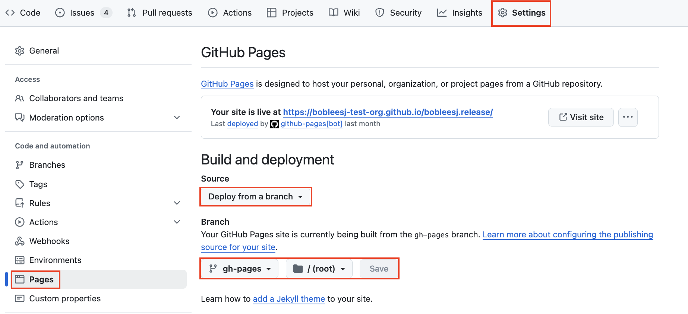

:tocdepth: -1

.. index:: release-guide

.. _release-guide:

===============================
How to release Python package
===============================

Overview
~~~~~~~~

This guide is written for those who have just cookiecuttered.

If you already have a conda package and if you are interested in just release a new version, read the instruction here.

PyPI/GitHub release
~~~~~~~~~~~~~~~~~~~~

.. _release-instructions-contributor:

Make sure you have your package cookiecuttered. Otherwise, please start from the Getting started page :ref:`here <getting-started>`

#. In the repository, create an issue on GitHub with the "Release" option as shown below:

   .. image:: ./img/add-personal-access-token.png
      :alt: add-personal-access-token
      :width: 600px

#. Check off all items in the first checklist for PyPI/GitHub release.

Instructions for Project Owner for release
~~~~~~~~~~~~~~~~~~~~~~~~~~~~~~~~~~~~~~~~~~~

.. _release-instructions-project-owner:

#. Review the checklist prepared by the contributor in the issue.

#. Ensure ``PYPI_TOKEN`` and ``PAT_TOKEN`` are configured at the org level. See Appendix :ref:`1 <pypi-token-setup>`, :ref:`2 <pat-token-setup>`, respectively.

#. Check the ``github_admin_username`` section in ``.github/workflows/build-wheel-release-upload.yml`` is that of the project owner.

#. In your terminal, run ``git checkout main && git pull upstream main`` to sync with the main branch.

#. Run the following::

    # For pre-release, use *.*.*rc* i.g. 1.0.0rc0
    # For release, use *.*.* i.g. 1.0.0
    git tag <version-number>
    git push upstream <version-number>

#. Done! Once the tag is pushed, visit the ``Actions`` tab in the repository to monitor the CI progress.

#. Comment ``GitHub/PyPI release done!`` or ``GitHub/PyPI pre-release done!`` in the release GitHub issue.

#. The contributor will make a PR into the conda-forge feedstock. Review and approve the PR.

#. Wait for the contributor to test the released package. The issue will be closed by the contributor.

.. _pypi-token-setup:

Appendix 1. Setup ``PYPI_TOKEN``
~~~~~~~~~~~~~~~~~~~~~~~~~~~~~~~~

Generate a PyPI API token from ``pypi.org``:

#. Visit https://pypi.org/manage/account/ and log in.

#. Scroll down to the ``API tokens`` section and click ``Add API token``.

#. Set the ``Token name`` to ``PYPI_TOKEN``.

#. Choose the appropriate ``Scope`` for the token.

#. Click ``Create token`` and copy the generated token.

Add the generated token to GitHub:

#. Navigate to the ``Settings`` page of the org (or repository).

#. Click the ``Actions`` tab under ``Secrets and variables``.

#. Click ``New org secret``, name it ``PYPI_TOKEN``, and paste the token value.

#. Done!

.. image:: ./img/add-pypi-secret.png
   :alt: add-pypi-secret
   :width: 600px

.. _pat-token-setup:

Appendix 2. Setup ``PAT_TOKEN``
~~~~~~~~~~~~~~~~~~~~~~~~~~~~~~~

The GitHub workflow needs to link with this privilege through a personal access token (PAT) of the project owner.

1. Visit https://github.com/settings/tokens

2. Click ``Generate new token`` and choose the classic option.

3. Under ``Note``, write, "GitHub CI release"

4. Set the Expiration date of the token.

5. Under ``Select scopes``, check ``repo`` and ``user``.

6. Scroll down, click ``Generate token``.

7. Done!

.. image:: ./img/add-personal-access-token.png
   :alt: add-personal-access-token
   :width: 600px

Copy and paste the ``PAT_TOKEN`` to your GitHub organization:

1. Visit ``Settings`` in the organization.

2. Click the ``Actions`` tab under ``Secrets and variables``.

3. Click ``New organization secret`` and add a new secret and name it as ``PAT_TOKEN``.

4. Done!

.. _gh-pages-setup:

Appendix 3. How to host your package documentation online
~~~~~~~~~~~~~~~~~~~~~~~~~~~~~~~~~~~~~~~~~~~~~~~~~~~~~~~~~~

You have API doc built and tested locally. Now you want to deploy your doc via i.e., ``https://diffpy.github.io/diffpy.utils`` using GitHub Pages.

#. Go to your ``Settings`` page in your repository and and click ``pages`` under ``Code and automation``.
#. Click ``Deploy from a branch`` under ``Source``. Below, choose ``gh-pages`` branch and ``/(root)`` and click ``Save``.

Done! Wait a few minutes and visit your GitHub Pages URL!
