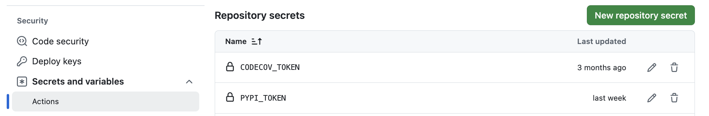
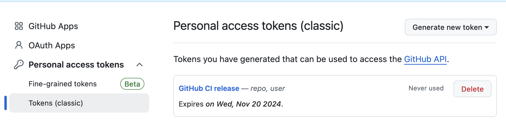

:tocdepth: -1

.. index:: release_guide
    
===============================
How to release a Python package
===============================

FAQ for PyPI/GitHub release
~~~~~~~~~~~~~~~~~~~~~~~~~~~~~~~~~~~~~~~

Q1. No conda-forge feedstock yet? Create one by following the instructions :ref:`here <create-feedstock>`.

Q2. Not a feedstock admin? Create an issue with the title/comment: ``@conda-forge-admin, please add user @username``. Example `issue <https://github.com/conda-forge/diffpy.pdffit2-feedstock/issues/21>`_.

Q3. Interested in pre-release? Please follow the instructions under the ``conda-forge: pre-release`` section :ref:`here <conda-pre-release>`_.

Instructions for GitHub repository contributors
~~~~~~~~~~~~~~~~~~~~~~~~~~~~~~~~~~~~~~~~~~~~~~~

When you are ready for PyPI and GitHub release, please follow these steps:

1. In the repository, create an issue on GitHub with the "Release" option.

2. Check off all items in the first checklist for PyPI/GitHub release.

3. After PyPI/GitHub release, create a PR into the conda-forge feedstock. While doing so, check off items in the second checklist. See Appendix 1.

4. After conda release, complete the third checklist and close the issue.

Instructions for Prof. Billinge for release
~~~~~~~~~~~~~~~~~~~~~~~~~~~~~~~~~~~~~~~~~~~

1. Review the checklist prepared by the contributor in the issue.

2. Ensure ``PYPI_TOKEN`` and ``PAT_TOKEN`` are configured at the org level. See Appendix :ref:`1 <appendix_pypi_token>`, :ref:`2 <appendix_pat_token>`, respectively.

3. In your terminal, run ``git checkout main && git pull upstream main`` to sync with the main branch.

4. Run the following::

    # For pre-release, use *.*.*rc* i.g. 1.0.0rc0 
    # For release, use *.*.* i.g. 1.0.0
    git tag <version-number>
    git push upstream <version-number>

5. Done! Once the tag is pushed, visit the ``Actions`` tab in the repository to monitor the CI progress.

Post GitHub/PyPI release for conda-forge release:

5. Comment ``GitHub/PyPI release done!`` or ``GitHub/PyPI pre-release done!`` in the issue.

6. The contributor will make a PR into the conda-forge feedstock. Review and approve the PR.

7. Wait for the contributor to test the released package. The issue will be closed by the contributor.

.. _appendix_pypi_token:

Appendix 1. Setup ``PYPI_TOKEN``
~~~~~~~~~~~~~~~~~~~~~~~~~~~~~~~~

Generate a PyPI API token from ``pypi.org``:

1. Visit https://pypi.org/manage/account/ and log in.

2. Scroll down to the ``API tokens`` section and click ``Add API token``.

3. Set the ``Token name`` to ``PYPI_TOKEN``.

4. Choose the appropriate ``Scope`` for the token.

5. Click ``Create token`` and copy the generated token.

Add the generated token to GitHub:

1. Navigate to the ``Settings`` page of the org (or repository).

2. Click the ``Actions`` tab under ``Secrets and variables``.

3. Click ``New org secret``, name it ``PYPI_TOKEN``, and paste the token value.

4. Done!

.. _appendix_pat_token:

Appendix 2. Setup ``PAT_TOKEN``
~~~~~~~~~~~~~~~~~~~~~~~~~~~~~~~~

The GitHub workflow needs to link with this privilege through a personal access token (PAT) of the admin (Prof. Billinge).

1. Visit https://github.com/settings/tokens

2. Click ``Generate new token`` and choose the classic option.

3. Under ``Note``, write, "GitHub CI release"

4. Set the Expiration date of the token.

5. Under ``Select scopes``, check ``repo`` and ``user``.

6. Scroll down, click ``Generate token``.

7. Done!

Copy and paste the ``PAT_TOKEN`` to your GitHub organization:

1. Visit ``Settings`` in the organization.

2. Click the ``Actions`` tab under ``Secrets and variables``.

3. Click ``New organization secret`` and add a new secret and name it as ``PAT_TOKEN``.

4. Done!
